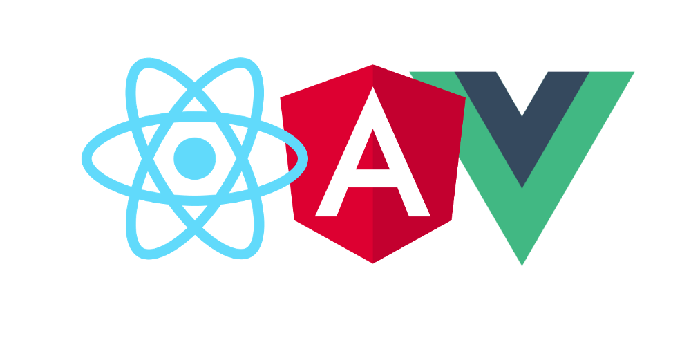

👋 Bienvenidos a la apasionante aventura del desarrollo web. Como no podía ser de otra manera, he decidido titular al primer post “Hello World”, cliché de la programación a la hora de iniciarse.

Antes de explicar en que consistirá este blog, me gustaría presentarme para que me conocierais un poco más. Me llamo [**Jorge G.Palacín**](http://jotagep.com/blog/authors/Jorge-G.Palacin), actualmente tengo 26 años y soy un apasionado de las tecnologías web. 

Mi principal pasión, y obsesión a tiempo completo, es **JavaScript**. Todo lo relacionado con este lenguaje de programación, que ha ganado tanta importancia en la ultima década. Por ese motivo me dedicaré a través de este blog a enseñaros las nuevas funcionalidades que ofrece.

  
  <figcaption>JavaScript Golden Age - Image from "treinaweb.com.br"</figcaption>

El contenido de mi blog comprenderá diversas tecnologías relacionadas con el desarrollo web en JavaScript:

- **Nuevas funcionalidades**: ECMAScript2015, ES6, Babel.
- **Uso de frameworks**: Angular, React, Vue.
- **Desarrollo de apps móviles**: Ionic, Capacitor, Cordova.
- **UI/UX Design**: Adobe XD, Sketch, Figma.
- **Bundlers**: Webpack, Parcel.
- **Node.js**: REST Api, OAuth.

Y mucho mas...

Sobre todo nos centraremos en la creación de tutoriales y posts para aprender sobre los "tres reyes" de las aplicaciones web en los últimos dos años: **React, Angular y Vue.**

  

Apúntate a este viaje conmigo y aumenta tus conocimientos web para llevar a cabo ese proyecto que siempre has soñado y nunca te has lanzado a emprenderlo.

Un saludo a todos y os espero en próximos posts.
