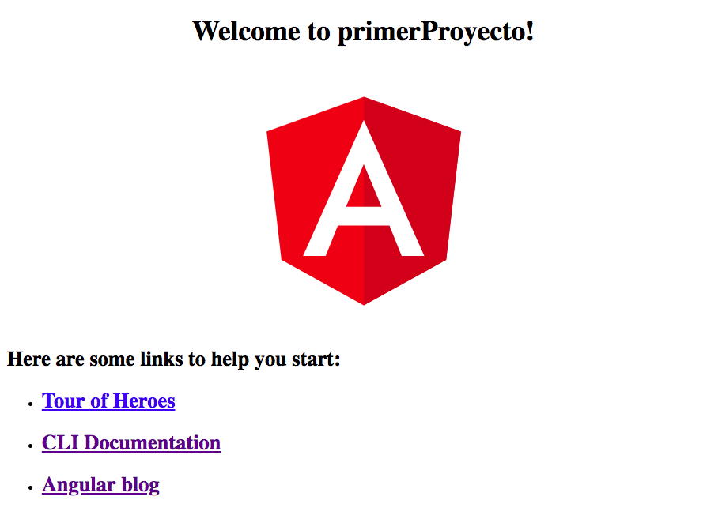

Buenas a todos, en el post de hoy daré comienzo a una nueva serie de publicaciones sobre el desarrollo web con Angular. Algunos que no estéis tan relacionados con el tema os preguntaréis, ¿Qué es angular?.

**[Angular](https://angular.io/)** es un framework **MVC** (*Modelo-Vista-Controlador*) desarrollado en **Typescript**, un superset de JavaScript, por **Google** a finales de 2016. Su principal función es la creacion de SPAs (*Single Page Application*). Otros frameworks similares son **[React](https://reactjs.org/)** y [**Vue**](https://vuejs.org/).

Los SPAs son aplicaciones de **una sola página**, es decir, la navegación entre las diferentes secciones del sitio se realizan de forma dinámica, al instante y sin refrescar la página en el navegador en ningun momento. Estas caracteristicas han incrementado el uso de estas en los ultimos años.

## ¿Cómo comenzar?

Para comenzar a usar angular en nuestras computadoras necesitamos tener instalada al menos una versión de **Node.js **8.x o superior y **npm** 5.x o superior.

Para comprobar si tenemos esa versión abrimos la terminal/consola de windows y tecleamos el siguiente comado.

```
$ node -v
```
    
```
$ npm -v
``` 

Si teneís una versión inferior, podeís descargaros la nueva versión de [Node.js y npm](https://nodejs.org/en/download/).

Una vez cumplamos estos requisitos podemos comenzar con la instalación del** CLI **(*Command Line Interface*) de Angular. Esta consola nos ayudara mucho a la hora de crear los diferentes elementos de nuestra aplicación en angular. Para ello ejecutaremos el comando:

```
$ npm install -g angular/cli
``` 

Perfecto, ahora ya estamos listos para crear nuestro proyecto.

## Creando nuestro primer proyecto

Para generar un nuevo proyecto, ejecutaremos el comando:

```
$ ng new primerProyecto
``` 

Mediante el comando "*ng new*" seguido del nombre que le queramos dar a nuestro proyecto, en este caso "*primerProyecto*", el CLI de angular se encarga de **instalar las dependencias** y **generar los ficheros** necesarios de nuestro nuevo proyecto.

Una vez termine de ejecutarse el comando anterior, ya tendremos nuestra aplicación web creada.

## Lanzamos el proyecto sobre un web server

Llegados a este punto, tendremos un directorio llamado "primerProyecto" que se nos creó en el paso anterior. Nos movemos dentro del directorio.

```
$ cd primerProyecto
``` 

Una vez dentro del directorio, para lanzar el** servidor** y asi poder ver nuestra aplicación en el navegador ejecutaremos:

```
$ ng serve --open
``` 

El comando "*ng serve*" nos despliega un servidor sobre el **puerto 4200**, por defecto, y el parametro "*--open*" nos abrira una ventana del navegador en la que podremos ver por primera vez la aplicación en marcha. 

<div className="Image__Small">
  
  <figcaption>Nuestra aplicación "primerProyecto" - localhost:4200</figcaption>
</div>

Esta imagen es la que nos tendría que aparecer en el navegador si hemos seguido correctamente los pasos anteriores. Se trata del componente principal que trae angular por defecto.

En el proximo post de la serie, os explicare la **estructura de directorios** y modificaremos el **componente principal**.

Un saludo a todos y hasta la proxima 😃.