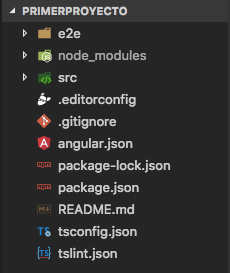
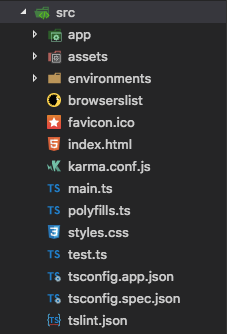
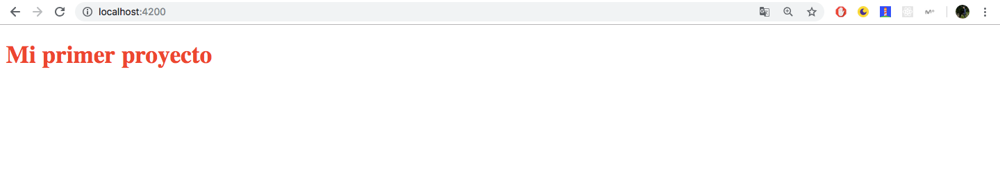

Continuamos con la serie sobre desarrollo de aplicaciones web en Angular. En el post de hoy, analizaremos la **estructura del directorio** y modificaremos nuestro **primer componente** del proyecto.

Partiendo del proyecto del [**post anterior**](https://blog.jotagep.com/angular-primeros-pasos/) ("*primerProyecto*"), generado con el **CLI, **nos habra creado todos estos directorios y archivos en la carpeta del proyecto. Vamos a explicar uno por uno para que podamos entender de que esta compuesto una aplicación en Angular.

<div className="Image__Small">
  
  <figcaption>Estructura de nuestro proyecto (primerProyecto).</figcaption>
</div>

- **e2e: **Esta carpeta*, *cuyo nombre es *"end to end",* contiene una serie de ficheros que se encargaran de realizar test automáticos, como si un usuario real interactuara con nuestra app. Profundizaremos más en proximos posts.
- **node_modules: **Es la carpeta que contiene todas nuestras dependencias de nuestro proyecto.
- **.editorconfig: **Configuración de nuestro editor de código.
- **.gitignore: **Los archivos o carpetas que debe ignorar git a la hora de añadirlos al repositorio.
- **angular.json: **Archivo json que contiene la configuración de angular. Este archivo incluye rutas, nombres, versiones, etc.
- **package.json: **Configuración de nuestra aplicación. Este archivo contiene el nombre de nuestra app, la version, todas las dependencias necesarias para su correcta ejecución, etc.
- **tsconfig.json: **Este archivo contiene la configuración de TypeScript.
- **tslint.json: **Es el *linter *de TypeScript, se usa para mantenibilidad y sostenibilidad de nuestro código.

Y os preguntareis, ¿no se ha saltado un directorio? 🤔. Efectivamente falta el directorio **src, ***source *de nuestra app, que es el más importante, ya que contiene todo el código, y por ese motivo lo deje para el final.

<div className="Image__Small">
  
  <figcaption>Directorio <b>src</b> de mi <i>primerProyecto</i></figcaption>
</div>

En este directorio se encuentra la carpeta **app, **que contiene el código de nuestra aplicación. También obsevamos la carpeta **assets, **que contiene los archivos estáticos, **environments, **contiene las variables de entorno, y muchos otros archivos que forman parte de nuestra aplicación.

Si accedemos a la carpeta **app, **podemos encontrar nuestro **componente principal** (*app.component.ts), *junto a su archivo de estilos css y su template html con el mismo nombre. También podemos encontrar el **módulo principal**, que envuelve nuestro componente.

Ahora vamos a dedicarnos a modificar nuestro componente principal. Para ello vamos en primera instancia a abrir la **template** de este (*app.component.html)*. Eliminamos todo el contenido que tenemos por defecto, y añadimos el siguiente tag:

```html
  <h1>Mi primer proyecto</h1>
```

Si tenemos el servidor lanzado, recuerden que era el comando "*ng serve -o", *podremos observar que ha cambiado el contenido de nuestra app.

Vamos a añadirle algun **estilo** a nuestro componente para que luzca con un color diferente. Para ello abrimos el archivo de estilos (*app.component.css), *y escribimos lo siguiente:

```css
h1 {
  color: red;
}
```

Una vez ya tenemos el estilo añadido, si comprobamos en nuestro navegador el estado de nuestra aplicación debería de ser tal que asi:

<div className="Image__Small">
  
  <figcaption>Estado del proyecto tras modificar la template y los estilos</figcaption>
</div>

Y *voila!, *ya tenemos nuestro primer componente modificado para que muestre este mensaje en pantalla.

En el próximo cápitulo de la serie entraré más en detalle sobre como se relacionan en Angular, los módulos, componentes, servicios, directivas, etc. 

Os espero en los próximos post y por [twitter](https://twitter.com/Sir_JotaG). Un saludo a todos y paz ✋
